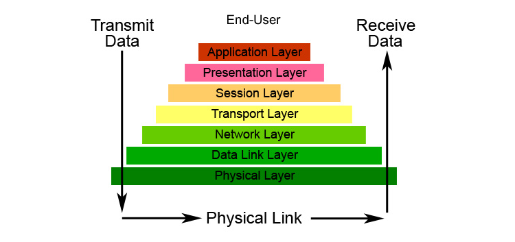
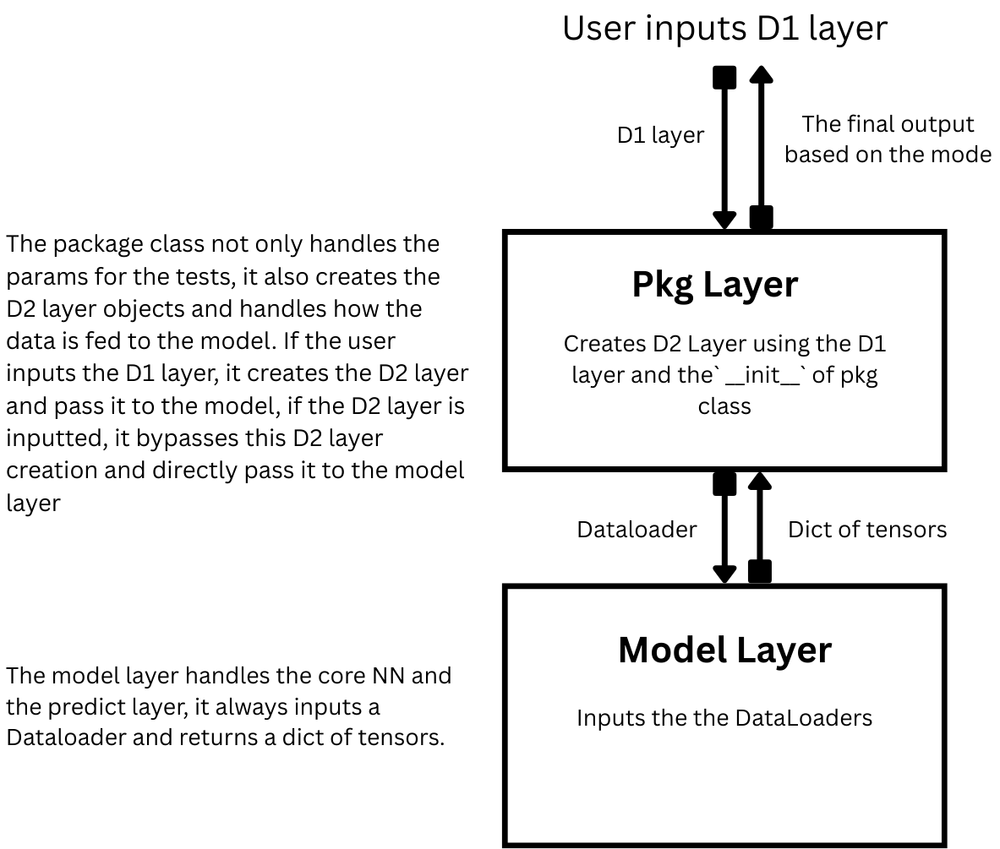

# Design Document for Prediction pipeline of `ptf-v2`
## Table of Contents
[TOC]

## Aim


Current beta version of `ptf-v2` doesnot have any functionality to do the predicitions and this design document aims to provide some possible ideas to implement the prediction pipeline

## Description of Status Quo (of v1)

The pipeline for v1 is quite straight forward:
1. Define the dataset and pass it to`TimeSeriesDataset`.
2. Initialise the model using `.from_dataset`.
3. Train the model using `Trainer.fit`
4. Perform predictions using `model.predict`.

###  1. Define the dataset and pass it to`TimeSeriesDataset`.

First load the data and define necessary params like `max_encoder_length`, `max_prediction_length` etc

#### Input
* DataFrame with columns: `time_idx`, `target`, `series`, `value`, etc.
* Static features and time-varying features split manually.
* Additional parameters like: 
    * `max_encoder_length`, `max_prediction_length`
    * `categorical_encoders` (e.g. `NaNLabelEncoder`)
    * `group_ids`

#### Type assumptions:
* Data must be properly typed and column-cast before passing.
* `series` must be cast to `str` manually - not inferred.

#### Output:
Instance of `TimeSeriesDataset` that knows the:
* Grouping
* Variable types
* Sequence lengths (input/output)
* Encoders

#### Code Snippets

##### Load Data
```python
data = generate_ar_data(seasonality=10.0, timesteps=400, n_series=100, seed=42)
data["static"] = 2
data["date"] = pd.Timestamp("2020-01-01") + pd.to_timedelta(data.time_idx, "D")
data = data.astype(dict(series=str)) # confusingly this step is always required to make the data "ready" for the TimSeriesDataset
# One of the pain points of the current API as said by ahmet (a ptf user) as it is not a standard workflow
```

##### Define the Datalaoders and TimeSeriesDataset
```python
# create dataset and dataloaders
max_encoder_length = 60
max_prediction_length = 20

training_cutoff = data["time_idx"].max() - max_prediction_length

context_length = max_encoder_length
prediction_length = max_prediction_length

# Dataset Creation
training = TimeSeriesDataSet(
    data[lambda x: x.time_idx <= training_cutoff],
    time_idx="time_idx",
    target="value",
    categorical_encoders={"series": NaNLabelEncoder().fit(data.series)},
    group_ids=["series"],
    static_categoricals=[
        "series"
    ],  
    time_varying_unknown_reals=["value"],
    max_encoder_length=context_length,
    max_prediction_length=prediction_length,
)

validation = TimeSeriesDataSet.from_dataset(training, data, min_prediction_idx=training_cutoff + 1)
batch_size = 128

# Dataloader creation
train_dataloader = training.to_dataloader(
    train=True, batch_size=batch_size, num_workers=0, batch_sampler="synchronized"
)
val_dataloader = validation.to_dataloader(
    train=False, batch_size=batch_size, num_workers=0, batch_sampler="synchronized"
)

```

(The code is taken from the [tutorial](https://github.com/sktime/pytorch-forecasting/blob/main/docs/source/tutorials/deepar.ipynb) for `DeepAR`)

### 2. Initialise the model

To initialise the model, we use `.from_dataset`. 

#### Inputs:
* `TimeSeriesDataset`
* Hyperparameters (e.g. `hidden_size`, `loss`, etc.) to the model

#### Type guarantees:
Extracts from dataset:
* input/output sizes,
* variable encoders,
* group information

#### Output:
Fully initialised model (e.g., `DeepAR` instance)

```python
import lightning.pytorch as pl

# Define Trainer
trainer = pl.Trainer(
    max_epochs=30,
    accelerator="cpu",
    enable_model_summary=True,
    gradient_clip_val=0.1,
    callbacks=[early_stop_callback],
    limit_train_batches=50,
    enable_checkpointing=True,
)


net = DeepAR.from_dataset(
    training, # Dataset
    
    # Hyperparams
    learning_rate=1e-2,
    log_interval=10,
    log_val_interval=1,
    hidden_size=30,
    rnn_layers=2,
    optimizer="Adam",
    loss=MultivariateNormalDistributionLoss(rank=30),
)
```

### 3. Train the model
To train the model we make use of `lightning.pytorch.Trainer`

#### Inputs:
* `Trainer` (from `lightning`)
* Dataloaders

#### Guarantees:
* Uses `TimeSeriesDataSet`'s batching
* Optional callbacks (e.g., early stopping, logging)

```python
trainer.fit(
    net,
    train_dataloaders=train_dataloader,
    val_dataloaders=val_dataloader,
)
```

### 4. Perform predictions using `model.predict`.

Now comes the most interesting part of the pipeline - prediction. `pytorch-forecasting` provides multiple "modes" for predictions like "raw", "quantiles" or "prediction".
* `mode="prediction"`
    * Returns point forecasts, typically the mean (or median) of the predictive distribution.
    * Uses the loss function’s `to_prediction()` method to generate usable forecasts.
* `mode="quantiles"`
    * Uses `to_quantiles()` from the loss .
    * Outputs a tensor shaped `(batch_size, horizon, n_quantiles)`. 
* `mode="raw"` 
    * Returns raw output from `forward()` before any post‑processing.
    * The returned object is a dictionary with all internal outputs.
    * If used with a tuple like `("raw", output_name)`, it extracts a specific field, where `output_name` is a name in the dictionary returned by `forward()`

#### Inputs:
* DataFrame or Dataloader
* mode: "raw", "prediction", "quantiles"
* Optional `trainer_kwargs`

##### Guarantees:
* If given a DataFrame:
    * It wraps it into a `TimeSeriesDataset` (reusing `.from_dataset`)
    * Constructs new dataloaders
* Internally uses `trainer.predict()` with `PredictCallback`

#### Output Types:
Here `N` is the size of validation data
* "prediction" -> tensor of shape`(N, prediction_length)`
* "quantiles" -> tensor of shape`(N, prediction_length, n_quantiles)`
* "raw" -> `dict` pf  raw predictions of `forward()` with shape`(N, prediction_length)` or `(N, prediction_length, params)` (where `params` can be `n_quantiles` or `params` for `DistributionLoss`) depending upon the type of loss we are using.
    * The keys of the output `dict` can have keys other than `"prediction"` as well, like `"decoder_attention"` etc, depending upon the model used. Some models(like `DeepAR`) return just a `dict` with one key - `"prediction"` while other models (like `TFT`) can return other keys as well.

*If you look at the first step, there we do `max_prediction_length=prediction_length` in `TimeSeriesDataset`, so here we can use `prediction_length` and `max_prediction_length` interchangeably*

```python
net.predict(
    val_dataloader, mode="raw", trainer_kwargs=dict(accelerator="cpu")
)
```
`predict` of `BaseModel` convert the data that is provided for the prediction to the `TimeSeriesDataset` (if dataframe is inputted) and creates the dataloaders as well if required.
It internally uses a special callback called `PredictCallback`([source](https://github.com/sktime/pytorch-forecasting/blob/main/pytorch_forecasting/models/base/_base_model.py#L213)) that is used to return the predictions in the desired mode along with other functionalities.

Some useful functionalities of `PredictCallback`:
* Save the predictions to a specific `output_dir` either at the end of every `epoch`([source](https://github.com/sktime/pytorch-forecasting/blob/81b5303eca5a1dd28e12945ecb1a9d34fa47211e/pytorch_forecasting/models/base/_base_model.py#L349)) or `batch`([source](https://github.com/sktime/pytorch-forecasting/blob/81b5303eca5a1dd28e12945ecb1a9d34fa47211e/pytorch_forecasting/models/base/_base_model.py#L334))
* Provide predictions in a desired mode (raw, quantile or prediction)
* Concatenates tensors across batches with NaN handling.

> ***NOTE: `trainer.predict()` can be used directly for prediction, but `model.predict()` wraps it with additional logic, like converting raw data to TimeSeriesDataSet, preparing loaders, and adding `PredictCallback`***

#### Getting final predictions
To get the final predicitons, `mode="prediction"` is used in `.predict()`.
There if you want to return specific parts (like `x`, actual `y` or `index`), you need to specify it separately.
```python
prediction = net.predict(
    val_dataloader,
    mode="prediction",
    return_index=True,
    return_x=True,
    return_y=True
)
```
*Outputs*
```python
prediction.output  # model's predicted output
prediction.index   # dataframe with time_idx and group identifiers
prediction.x       # original input tensors used (dict with keys like 'encoder_cont', etc.)
prediction.y       # actual target values used during prediction

```
In the above snippet, you will get `predictions` that has `index`, `x` and `y` returned as well and then you can change it to dataframe if you want manually.
> **Thought: Maybe we should add some `to_dataframe` or similar function that does it internally and user dont have to manually transform the tensors to dataframe (in v2).**

### Save and Reload the Model

The user uses `model.save()` and `model.load()` to persist both model weights and necessary metadata like hyperparameters, encoders, and dataset config.

#### Saving the Model
##### Inputs:
* Trained model (instance of a subclass of `BaseModel`)
* Path to save the model checkpoint (`.ckpt` or `.pt`)

##### Guarantees:
Saves:
* `state_dict` (i.e., model weights)
* Hyperparameters
* Categorical encoders and variable transformations (important for reproducibility)

##### Outputs:
A `.ckpt` or `.pt` file containing the model and metadata
```python
# Save the trained model
net.save("deep_ar_model.pt")
```

#### Reloading the Model

##### Inputs:
* Saved checkpoint path

##### Guarantees:
* Restores:
    * Architecture
    * Optimizer state (if using `.load_from_checkpoint()`)
    * All dataset-related metadata
* Ensures model can be used for further training or inference without re-defining encoders manually.

##### Outputs:
A fully initialized model (e.g., `DeepAR`) with weights and configuration loaded
```python
# Reload model from .pt
model = DeepAR.load("deep_ar_model.pt")
```

Alternatively, if using `lightning` checkpointing:

```python
model = DeepAR.load_from_checkpoint("lightning_logs/version_0/checkpoints/epoch=29-step=1500.ckpt")
```


## Proposal for predict of v2

### Motivation
In practice, users have diverse prediction needs:
* **Exploratory analysis:** Quickly run predictions and inspect results in a DataFrame or plot.
* **Backtesting:** Predict on validation sets and compute metrics like MAE or RMSE.
* **Probabilistic forecasting:** Get full quantile distributions rather than just point estimates.
* **Debugging:** Inspect raw model outputs, attention maps, and hidden states.

In v1, much of this was possible, but:
* The functionality was not fully decoupled from internal assumptions.
* Metadata handling relied heavily on the dataset class.
* There was no consistent utility for converting tensors to structured formats.
* Disk-based prediction saving was possible but under-documented.

In v2, we should try to design `.predict()` to be more general, composable, and predictable while retaining ease of use.

### Requirements
From the above, we identify key requirements:
1. Input flexibility:

    Accept:
    * High-level D2 layer objects (DataModules).
    * DataLoader objects.

2. Output flexibility
    * Modes:
      * `"prediction"` (point forecasts)
      * `"quantiles"` (full probabilistic forecasts)
      * `"raw"` (unprocessed model outputs)
    * Additional info via `return_info`: "index", "x", "y", "decoder_lengths".

3. Scalability
    * Option to write predictions to disk at batch or epoch level.
    * Avoid storing entire results in memory for very large datasets.

4. Ease of post-processing

    Built-in utilities for:
    * Converting prediction tensors to Dataframes or CSVs.
    * Plotting predictions vs. actuals.

5. Trainer integration
    * Implemented via `trainer.predict()` for consistency with Lightning.
    * Use a dedicated `PredictCallback` for extensibility and disk writing.
### Design Principles
The design follows these principles:
* **Separation of responsibility:** Prediction logic lives in `.predict()`, processing logic in `to_prediction()`/`to_quantiles()`, and formatting logic in utilities like `to_dataframe()`.
* **Extensibility:** Users can subclass `PredictCallback` to customize output handling.
* **Reproducibility:** Outputs can include metadata for exact run reconstruction.
* **Memory safety:** Large predictions can be streamed to disk without exhausting RAM.

### High-Level Summary
The proposed `.predict()` system for v2:
* User calls `.predict()` with:
    * A `TimeSeries` Dataset, `DataModule` or `DataLoader`.
    * A mode (`prediction`, `quantiles`, `raw`).
    * Optional `return_info` list.
    * Optional `output_dir` for disk writing.
    * Any additional Trainer kwargs.

* Internally:
  * `.predict()` wraps `trainer.predict()` with a custom `PredictCallback`.
  * `PredictCallback`:
    * Processes raw outputs via `model.to_prediction()` or `model.to_quantiles()`.
    * Collects additional requested info.
    * Writes to disk if configured.
  * Once prediction is complete, `PredictCallback.result` returns a dictionary of tensors.

* Post-processing:
  * Users can call `to_dataframe()` to convert outputs into a structured DataFrame.
  * Users can plot results with `plot_predictions()`.

### Implementation Plan
We should learn from the prediction pipeline of v1 and have some functionalities like v1 in v2 as well.
Some things that we should borrow:
* `mode` in `.predict()` 

     We should allow the user to decide what kind of prediction (fully processed or raw) they want. It should have atleast the already available modes:
    * `prediction`
    * `quantiles`
    * `raw`
* Use of `PredictCallback`

    We could use `trainer.predict()` to make the predictions, but `PredictCallBack` provides some special customisations like a way to save the predictions directly in a `output_dir` and customised prediction writing to the output_dir at epoch_end or batch_end. `model.predict()` will internally call `trainer.predict()` but with `callback=PredictCallBack`.
* `model.predict()` should accept D2 layer or the dataloaders.


Other important features:
* We should add some inbuilt util function that provides the final dataframe (or csv file, if predictions are very large to be saved in a memory) from the prediction tensors (if mode="prediction").
* predict should return a `dict` of tensors (or a D1 layer?).
* We should also add some utils to plot predictions and the actual values

#### The Layered Approach
As suggested by @fkiraly, we can try a layered approach similar to the OSI model of Computer Networks. The model has multiple layers, and the data is transferred from one layer to another.



We should also try a similar approach. The user inputs depends on how the `data` is moved across the layers:
* D1 Layer:
  * The `data` is passed to the **Package layer** (also called **M layer**), which creates the D2 Layer, which then loads the dataloader and passes it to the model
* D2 Layer:
  * The `data` is still moves through the **Package Layer**, it just creates the dataloaders and these dataloaders are sent to the **model layer**
* Dataloaders:
  * The `data` passes as it is through the **Package Layer** and is sent to the **model layer**



The main `.predict()` logic still resides in the **model layer**, but its wrapper exists in the **Package Layer**, which just checks one thing - if the input `data` is D1 layer, D2 layer or dataloader.
(Here `data` represents the param `data` in the `.predict()` (see [Public API Definition](#Public-API-Definition)))

#### Public API Definition
The `.predict()` method signature for all models in v2:

```python
def predict(
    data,
    mode: str = "prediction",  # "prediction", "quantiles", "raw"
    return_info: list[str] | None = None,  # e.g. ["index", "x", "y", "decoder_lengths"]
    write_interval,  # when to write to the disk?
    output_dir: str | None = None,  # if provided, stream to disk
    **trainer_kwargs,
) -> dict[str, torch.Tensor]:
    ...
```
Key points:
* `data` can be D1 Dataset object, D2 DataModule or a PyTorch DataLoader.
* `mode` determines output processing function (`to_prediction()`, `to_quantiles()`, or no processing).
* `return_info` specifies extra metadata to include.
* `output_dir` enables large-scale predictions without RAM bottlenecks.

#### The Package Layer
The Package Layer will wrap the whole `Lightning` workflow. This would make the flow very streamlined and user don't have to import `trainer` and define it, it will be handled by the `_pkg` class.

* **Train from scratch**
```python
# assuming train_dataset, test_dataset are D1 layer objects
# define cfgs
model_cfg = dict(
    hidden_size=64,
    num_layers=2,
    attention_head_size=4,
)

trainer_cfg = dict(
    max_epochs=5,
    accelerator="auto",
    devices=1,
    enable_progress_bar=True,
    log_every_n_steps=10,
)
datamodule_cfg = dict(
    max_encoder_length=30,
    max_prediction_length=2,
    batch_size=32,
    ..., # other params like target_normalizer, num_workers etc
)
# init package
pkg = model_pkg(TFT, model_cfg, trainer_cfg=trainer_cfg, datamodule_cfg=datamodule_cfg)

# training
pkg.fit(train_dataset)

# prediction
preds = pkg.predict(test_dataset, mode= "raw", ...)
```
* **Load pretrained model**
```python
pkg = model_pkg(TFT, trainer_cfg=trainer_cfg, ckpt_path="checkpoints/last.ckpt", datamodule_cfg="checkpoints/dm_cfg.pkl")
preds = pkg.predict(test_dataset, mode= "raw", ...)
```
> Here one more way is to save the `datamodule_cfg` inside the model params, not sure which way is better
* **Train, then later reload for inference**
```python
# Train + save
pkg = model_pkg(TFT, model_cfg, trainer_cfg=trainer_cfg)
pkg.fit(train_dataset, save_ckpt=True)
# -> Lightning saves checkpoint automatically

# Later, in a new session:
pkg2 = model_pkg(TFT, trainer_cfg=trainer_cfg, ckpt_path="checkpoints/last.ckpt")
preds = pkg2.predict(new_dataset)
```

#### Internal Prediction Flow
1. Resolve inputs
   * If given a D1 layer, create D2 Layer (inside the **Package Layer**) and pass it to the **Model Layer**.
   * If given a DataModule, load the dataloaders (inside the **Package Layer**).
   * If given a DataLoader, use directly.

2. Setup `PredictionCallBack`
    * Instantiate a `PredictCallback` with parameters:
       * `mode`
       * `return_info`
       * `output_dir`
    * This callback:
       * Calls the model’s `to_prediction()` / `to_quantiles()` based on mode.
       * Collects any requested metadata.
       * Either accumulates results in-memory or writes to `output_dir`.

3. Run predictions

    Use `trainer.predict()` in combination with the `PredictCallback`. The `model.predict()` method will internally call `trainer.predict()` with `PredictCallback` already configured for processing outputs, handling metadata, and optional disk streaming.

    Users can also choose to call `trainer.predict()` directly without using `model.predict()`.

    However:
   * This bypasses the built-in `PredictCallback`.
   * To still benefit from `PredictCallback` when using `trainer.predict()` directly, users must import and attach it manually.

4. Return structured results
    * If `output_dir` is `None`, return `dict[str, torch.Tensor]`.
    * If `output_dir` is set, return `None` (data is on disk).

### Processing Functions
* `to_prediction(batch_output)`
    * Converts raw model outputs to point forecasts.

* `to_quantiles(batch_output)`
    * Extracts quantile forecasts into a structured tensor/dict.

* Raw mode
    * Returns unmodified model outputs.
### Output Utilities
Provide built-in utilities for post-processing:

* `to_dataframe(predictions, ...)`
    * Converts dict[str, torch.Tensor] to pd.DataFrame.
    * Handles time index reconstruction if available.


* `plot_predictions(pred_df, actual_df)`
    * Quick visualisation of predicted vs actual series.


### High Level Vignettes
* ***`TimeSeries` (D1 layer) object as input***
```python
import pandas as pd
from pytorch_forecasting.data import TimeSeries
from pytorch_forecasting.models import DeepAR
# get the dataframe
data_df = pd.read_csv("latest_sales_data.csv")

# Create the D1 Layer
dataset = TimeSeries(
    data = data_df,
    time="time_idx",
    target="y",
    group=["series_id"],
    num=["x", "future_know_feature", "static_feature"],
    cat=["category", "static_feature_cat"],
    known=["future_known_feature"],
    unknown=["x", "category"],
    static=["static_feature", "static_feature_cat"],
)
trainer_cfg = dict(
    max_epochs=5,
    accelerator="auto",
    devices=1,
    enable_progress_bar=True,
    log_every_n_steps=10,
)

pkg = Model_pkg(DeepAR, trainer_cfg=trainer_cfg, ckpt_path="checkpoints/last.ckpt", datamodule_cfg="checkpoints/dm_cfg.pkl")
# Perform the prediction
prediction_output = pkg.predict(
    dataset, 
    mode="prediction",
)

# `prediction_output` is a dictionary-like object of tensors:
# >>> prediction_output.keys()
# dict_keys(['prediction'])
```

* ***"quantiles" Mode and Datamodule as input***
```python
import pandas as pd
# Datamodule can be any LightningDatamodule Class child
from pytorch_forecasting.data import TimeSeries, DataModule 
from pytorch_forecasting.models import DeepAR
from pytorch_forecasting.utils import to_dataframe # New utility function

max_encoder_length = 60
prediction_length = 20
# Load the self-contained model
model = DeepAR.load_from_checkpoint("my_model.ckpt")

# Predict on new data
data_df = pd.read_csv("latest_sales_data.csv")
dataset = TimeSeries(
    data = data_df,
    time="time_idx",
    target="y",
    group=["series_id"],
    num=["x", "future_know_feature", "static_feature"],
    cat=["category", "static_feature_cat"],
    known=["future_known_feature"],
    unknown=["x", "category"],
    static=["static_feature", "static_feature_cat"],
)
# Disclaimer: the naming of param may differ depending the Datamodule being used
# Eg: ``max_encoder_length``(used in ``EncoderDecoderDataModule``) is replaced by 
# ``context_length`` in ``TslibDataModule``
data_module = DataModule(
    time_series_dataset=dataset,
    max_encoder_length=max_encoder_length,
    max_prediction_length=prediction_length,
    batch_size=32,
    ..., # other params like target_normalizer, num_workers etc
)

pkg = Model_pkg(DeepAR, trainer_cfg=trainer_cfg, ckpt_path="checkpoints/last.ckpt")
prediction_output = pkg.predict(
    data_module, 
    mode="quantiles",
    return_info=["index"]  # return index to get time_idx and groups
)

# `prediction_output` is a dictionary-like object of tensors:
# >>> prediction_output.keys()
# dict_keys(['prediction', 'index'])

# Convert the tensor output to a user-friendly DataFrame
forecast_df = to_dataframe(
    prediction_output,
    ... 
)

# `forecast_df` is the same clean DataFrame as before:
#
#                            prediction_p50  prediction_q_0.05  prediction_q_0.95
# group_id    time_idx
# store_A     501                   150.5              130.2              170.8
# ...
```

* ***BackTesting (with "prediction" mode) and Dataloader as input***
```python
# Assume `trainer`, `model`, and `val_dataloader` are defined from the training script
model_cfg = dict(
    hidden_size=64,
    num_layers=2,
    attention_head_size=4,
)
pkg = Model_pkg(DeepAR, model_cfg, trainer_cfg=trainer_cfg, datamodule_cfg= datamodule_cfg)
pkg.fit(model, train_dataloader, val_dataloader)

# Predict on the validation dataloader
backtest_output = pkg.predict(
    val_dataloader,
    return_info=["y", "index"],  # return index and y
)

# `backtest_output` contains predictions plus the requested info
# >>> backtest_output.keys()
# dict_keys(['prediction', 'y', 'index'])

# Compute MAE on the backtest period
mae_metric = MAE()
mae_value = mae_metric(
    backtest_output["prediction"],
    backtest_output["y"]
)

```

* ***"raw" mode***
```python
raw_output = pkg.predict(
    val_dataloader,
    mode="raw"
)

# `raw_output` is the dictionary of tensors the user wants
# >>> raw_output.keys()
# dict_keys(['prediction', 'x', 'encoder_cont', 'decoder_attention'])

# Extract tensors for analysis
attention_tensor = raw_output["decoder_attention"]

print(f"Attention tensor shape: {attention_tensor.shape}")
# >>> Attention tensor shape: torch.Size([512, 20, 8, 60]) # as an example
```
### Internal working plan
* ***Package Class***
```python
from lightning.pytorch import Trainer
from lightning.pytorch.callbacks import ModelCheckpoint

class Model_pkg:
    def __init__(self, model_cls, model_cfg=None, trainer_cfg=None, datamodule_cfg=None, ckpt_path=None):
        self.model_cls = model_cls
        self.model_cfg = model_cfg or {}
        self.datamodule_cfg = datamodule_cfg or {}
        self.trainer_cfg = trainer_cfg or {}
        self.ckpt_path = ckpt_path
        self.model = None
        self.trainer = None

    def fit(self, dataset, save_ckpt=False, ckpt_dir="checkpoints"):
        # add checkpoint callback if requested
        callbacks = []
        if save_ckpt:
            checkpoint_cb = ModelCheckpoint(
                dirpath=ckpt_dir,
                filename="{epoch}-{val_loss:.2f}",
                save_top_k=1,   # keep best model
                monitor="val_loss", # assumes val_loss is logged
                mode="min"
            )
            callbacks.append(checkpoint_cb)

        # build trainer
        self.trainer = Trainer(callbacks=callbacks, **self.trainer_cfg)

        # datamodule + model
        self.datamodule = self._build_datamodule(dataset)
        if self.model is None:
            self.model = self.model_cls(**self.model_cfg)

        self.trainer.fit(self.model, self.datamodule)

        # if ckpt saving enabled, return path
        if save_ckpt:
            return checkpoint_cb.best_model_path
        return None

    def predict(self, dataset, ckpt_path=None):
        predict_dm = self._build_datamodule(dataset)
        dataloader= self._create_dataloaders(predict_dm)
        model = self.model_cls.load_from_checkpoint(ckpt_path) if ckpt_path else self.model
        preds = self.model.predict(model, dataloader)
        return preds

    def _build_datamodule(self, dataset):
        return DataModule(dataset, **self.datamodule_cfg)
    
    def _create_dataloaders(self, datamodule):
        return datamodule.test_dataloader
```


* ***PredictCallBack (similar to the one in v1)***


```python
from lightning.pytorch.callbacks import BasePredictionWriter
class PredictCallback(BasePredictionWriter):
    """Internally used callback to capture predictions and optionally write them to disk.
    
    This callback is used internally by a model's `.predict()` method. It
    captures the raw output from the model, processes it according to the
    specified `mode` (e.g., converting to point predictions or quantiles),
    and collects any other requested information like input data (`x`),
    actuals (`y`), and indices.

    The final, collated results can be accessed through the `.result` property,
    which returns a dictionary of tensors(or should it be the D1 layer?).

    Parameters
    ----------
    mode : str
        The prediction mode. Determines how the raw model output is processed.
        Should be one of "prediction", "quantiles", or "raw".
    return_info : Optional[List[str]], default=None
        A list specifying which additional information to return alongside
        predictions. Valid entries:
        
            - "index" : Return the group and time indices for each prediction.
            - "x" : Return the full input dictionary (`x`) for each prediction.
            - "y" : Return the actual target values (`y`) corresponding to predictions.
            - "decoder_lengths" : Return the lengths of the decoder sequence.
            
        If None or empty, only predictions are returned.
    write_interval : str, default="batch"
        When to perform the collection step.
    output_dir : Optional[str]
        Path to a directory where predictions can be saved. If provided,
        predictions will be written to files in this directory.

    Attributes
    ----------
    result :  Dict[str, Any]
        The final, collated prediction result tensors. 

    Notes
    -----
    This callback is designed to be instantiated and used within a model's
    `.predict()` method, which handles passing the necessary configuration.
    """  

    def __init__(
        self,
        mode, # prediction mode
        return_info, # list of str                                      
        write_interval,  # when to write to the disk?
        output_dir,
        **anyother_param_and_kwargs
    ):
        super().__init__(write_interval=write_interval)
        # initialise params
        self.mode = mode
        self.return_info = return_info
        self.output_dir = output_dir

        # any other initialisatioins
    
    def _reset_data(self):
        self._output = []
        self._decoder_lengths = []
        self._x= []
        self._index = []
        self._y = []
        self._result = []
        
    def on_predict_batch_end(
        self,
        trainer: Trainer,
        pl_module: LightningModule,
        outputs: Any,
        batch: Any,
        batch_idx: int,
        dataloader_idx: int = 0,
    ):
        # override the func from base class to write output based on modes
        if mode=="prediction":
            pl_module.to_prediction()
        if mode=="quantiles":
            pl_module.to_quantiles()
            
           
        if "x" in self.return_info:
            self._x = x
            # save x
        if "index" in self.return_info:
            self._index = index
            # save index
        if "decoder_lengths" in self.return_info:
            self._decoder_lengths = decoder_lengths
            # save decoder length
        if "y" in self.return_info:
            self._y = y
            # save y
            
        # other logic
        
        
    def write_on_batch_end(
        self,
        trainer,
        pl_module,
        prediction,
        batch_indices,
        batch,
        batch_idx,
        dataloader_idx,
    ):
        # write the data
        
        self._reset_data()
    
    # anyother function if required
 
            
    @property
    def result:
        if self.mode=="prediction":
            result = self.get_final_preds(self.return_type)
        else:
            result = self._result
        return result
```
* ***`model.predict()`***

```python
# Inside the BaseModel

def predict(
    data, 
    mode, # prediction mode
    return_info,
    write_interval,  # when to write to the disk?
    output_dir,
    trainer_kwargs, # kwargs for trainer like enable_progress_bar etc
    **anyother_param_and_kwargs
):
    """
     Generate predictions for new data.

    This method provides a high-level interface for making forecasts. It can
    accept either a `DataModule` or a dataloader.

    Parameters
    ----------
    data :  DataLoader
        A pre-built DataLoader for prediction.
        
    mode : str
        The prediction mode. One of "prediction", "quantiles", or "raw".
        
        - "prediction": Returns final predictions.
        - "quantiles": Returns a forecast for each quantile defined in the
          model's loss function.
        - "raw": Returns the raw, unprocessed output of the network.
        
    return_info : Optional[List[str]], default=None
        A list specifying which additional information to return alongside
        predictions. Valid entries:
        
            - "index" : Return the group and time indices for each prediction.
            - "x" : Return the full input dictionary (`x`) for each prediction.
            - "y" : Return the actual target values (`y`) corresponding to predictions.
            - "decoder_lengths" : Return the lengths of the decoder sequence.
            
        If None or empty, only predictions are returned.
    output_dir : Optional[str]
        Path to a directory where predictions can be saved. 
        
    trainer_kwargs:
        kwargs for `Trainer`
    **kwargs:
        Additional keyword arguments passed to the model's processing methods,
        such as `to_prediction()` or `to_quantiles()`. For example, you can
        override the default quantiles by passing `quantiles=[0.1, 0.5, 0.9]`.


    Returns
    -------
    Dict[str, Any]
        The final, collated prediction result tensors. 
    """
    
    predict_callback=PredictCallback(
            mode=mode,
            return_info = return_info,
            write_interval=write_interval,
            output_dir=output_dir,
            **kwargs
    )
    trainer_kwargs.setdefault(
            "callbacks", trainer_kwargs.get("callbacks", []) + [predict_callback]
        )
    
    trainer = Trainer(fast_dev_run=fast_dev_run, **trainer_kwargs)
    trainer.predict(self, dataloader)
    # logging logic
    
    return predict_callback.result
```
* ***`model.to_prediction()` & `model.to_quantiles`***

```python
# Inside the BaseModel (similar to v1)

def to_prediction(self, out: dict[str, Any], **kwargs):

        if isinstance(self.loss, MultiLoss):
                out = [
                    Metric.to_prediction(loss, out["prediction"][idx])
                    for idx, loss in enumerate(self.loss)
                ]
        else:
                out = Metric.to_prediction(self.loss, out["prediction"])
                
        return out

def to_quantiles(self, out: dict[str, Any], **kwargs):

        if isinstance(self.loss, MultiLoss):
                out = [
                    Metric.to_quantiles(
                        loss,
                        out["prediction"][idx],
                        quantiles=kwargs.get("quantiles", loss.quantiles),
                    )
                    for idx, loss in enumerate(self.loss)
                ]
        else:
                out = Metric.to_quantiles(
                    self.loss,
                    out["prediction"],
                    quantiles=kwargs.get("quantiles", self.loss.quantiles),
                )
                
        return out
```
* ***Another util to transform the tensors to a dataframe***
```python
    def to_dataframe(predictions, ... # still need to figure out exact params this util will require):
        # transform the prediction tensors to dataframe
```
> **NOTE: We still have to try and see if we could fit this `to_dataframe` utility in `PredictCallBack` without requiring the metadata from D2 layer (maybe just `return_info` is sufficient).**

### open questions:
<!-- * I think `return_type` should only work with `prediction` mode, for other modes, only returning tensors should suffice?  -->
* Should the `return` be `tensors` or the D1 layer? which is more intitutive and more useful for the user?


