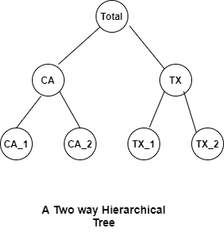
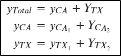
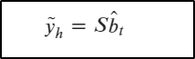
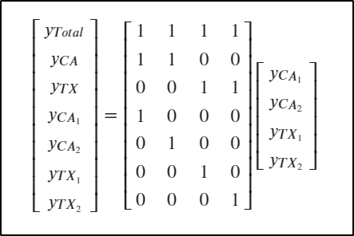
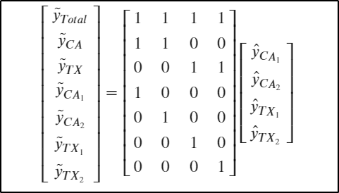
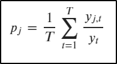
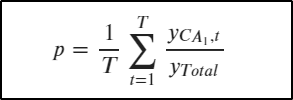
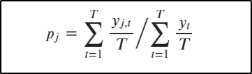
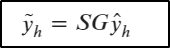

# Hierarchical time series

## Introduction

A Time Series which follows an hierarchical aggreagted structure for example across geographical areas.
From Store Level to District Level to State Level and then Country Level. The following picture depicts such a hierarchy(insipred from [M5 Walmart Data](https://www.kaggle.com/c/m5-forecasting-accuracy)). 

<br>
The challenge lies in Forecasting across the geographical divisions with highest accuracy.

For any time **t**, the observations at the bottom level will sum up to series above,<br>

 <br>

 A more general form of representation will be:<br>
 

where **b<sub>t</sub>** are the base forecasts, **S** is the summation matrix and **$\tilde{y}_h$** the aggragated data.

The matrix form:<br>


## Approaches for Hierarchichal Forecasting

### The Bottom Up Approach

A simple method for generating coherent forecasts is the Bottom Up Approach.The coherent forecasts are produced by summing up the bottom level individual forecasts. To represent in Matrix notation:<br>


### The Top Down Approach
This involves generating forecasts at the top level and then disaggregating the forecasts to individual levels based on proportions.

A general notation for this will be

Based on the above example, for store CA_1 the forecast will be:<br>
<br>
where **p** is the historical proportion of sales at **CA_1 store**.
The computation of **p** can be done in two ways:
#### 1.Average historical proportions.
A general notation for this is<br>
<br>

where, **y<sub>j,t</sub>** is the historical value for bottom level series **j** at time **t** and<br> **y<sub>t</sub>** is the total aggregate, over the period t=1,2,...,T.<br><br>
For our example:<br>
<br> 
#### 2.Proportions of the historical averages.<br>
<br>

## The Optimal Reconciliation

Considering a more generalized form to represent Hierarchical Forecasts, the mapping matrices can be represented as:<br>
<br>
where **S** is summation matrix and *$\hat{y}$* are the set of base forecasts. The optimal reconciliation approach is about finding the optimal **G** matrix which in turn provides the most accurate coherent forecasts $\tilde{y}$.<br>

[More Reading](https://otexts.com/fpp2/reconciliation.html)


## API Design(Initial Version)
```
base_forecasts = ['CA_1','CA_2','TX_1','TX_2'] 
reconciled_forecasts = reconcile(base_forecasts,method='bu')
```

## References
1. https://otexts.com/fpp2/hierarchical.html
2. [R Package](https://cran.r-project.org/web/packages/hts/index.html) 
3. [Python Package](https://pypi.org/project/scikit-hts/)

## Examples(Python Package)
1. [ScikitHTS Example](https://github.com/carlomazzaferro/scikit-hts)
2. [Example Notebook in Python](https://colab.research.google.com/drive/1thHtaUS-8boRRVqZ1pYiog8zpljndxAu?usp=sharing)
